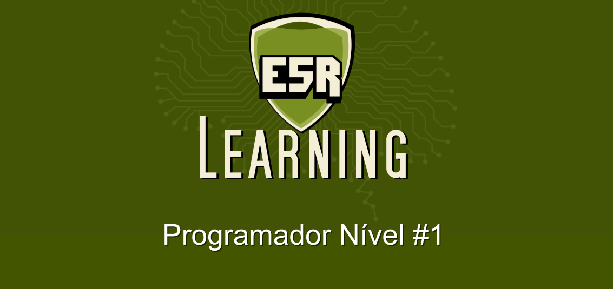

Curso "Programador Nível #1"
============================

> _by_ [**E5R Development Team**](@e5r), _author_ [**Erlimar Silva Campos**](@erlimar)

## Público alvo

* Pessoas interessadas em iniciar no mundo do desenvolvimento de software mas que não tem nenhum conhecimento ainda.
* Programadores que já sabem alguma linguagem de programação mas que desejam revisar seus conhecimentos mais básicos.

## O que vou aprender?

Neste curso você aprenderá os conceitos mais básicos da programação, sem focar diretamente em uma linguagem específica,
mas passeando por várias delas para demonstrar os vários paradigmas da programação e como eles são aplicados nas linguagens
mais conhecidas do mercado.

Este curso é um pré-requisito para os cursos de "linguagens de programação".

## Conteúdo

* [Introdução](doc/course/intro.md)
* [Capítulo 1 - O mundo dos computadores](doc/course/chapter-01/intro.md)
  - [Título ](doc/course/chapter-01/*.md)
* [Capítulo 2 - As Linguagens de Programação](doc/course/chapter-02/intro.md)
  - [Paradigmas das Linguagens de Programação ](doc/course/chapter-02/paradigms.md)