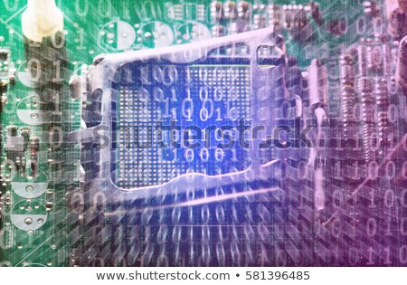
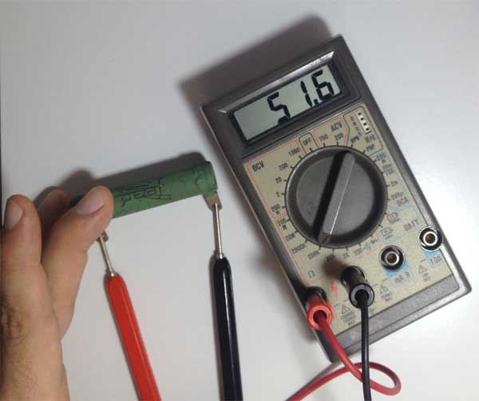

O formato binário
=================

Naveguação | [ANTERIOR][_A] | [TOPO][_H] | [PRÓXIMO][_P]
-----------|----------------|------------|--------------

Aquário é _algo que contém água_, mostruário é _amostra de algo_, portuário é _algo que tem a ver com portos_,
e **binário** é _ALGO QUE ESTÁ EM DOIS_.

Parece simples, e realmente é.
Por outro lado, toda a complexidade em volta do assunto _binário_, tem a ver com o fato de não nos darem mais explicações para isso. Sempre ouvimos algo como: É só zero e um, verdadeiro ou falso, ligado ou desligado. E apesar de ser tão simples como zero e um, quando estamos falando de _"formato binário"_ ou _"código binário"_, nos parece que esses zeros e uns não são suficientes.

Neste tópico vou me atentar em explicar o que é _"formato binário"_ e _"código binário"_. Mas antes disso quero deixar algumas coisas claras.

## Conceitos pré-estabelecidos

Algumas coisas vamos deixar claro agora. Mesmo que você ainda ache isso meio obscuro, podemos pelo menos dizer que temos três coisas em mente (mesmo que seja só decorado).

### 1º) O computador "vê" tudo como zeros e uns

Tudo que é gravado no computador ou está em execução, é representado internamente como se fosse uma fila de números que contém somente zeros e uns.

    0101010101010101010101010101010101010101010101010101...

### 2º) Zero e um na verdade é ligado ou desligado

A forma correta de representarmos os dados que o computador processa seria com um "ligado" ou "desligado", porque está diretamente relacionado com o fato do computador ser um dispositivo que funciona com energia elétrica, e cada informação é como se fosse um terminal que está "ligado" ou "desligado". Não existe outro estado de cada terminal.

Poderíamos usar "L" pra ligado e "D" para desligado, mas aí seria:

    LDLDLDLDLDLDLDLDLDLDLDLDLDLDLDLDLDLDLDLDLDLDLDLDLDLD...

Neste caso, o "0" para desligado e "1" para ligado fica mais legível, e por se tratar de número, fica mais fácil relacionar com a matemática e os cálculos que iremos fazer com esses dados.

### 3º) Os bits não são visíveis

A essa informação que pode ser ou "0" ou "1", ou "ligado" ou "desligado", damos o nome de BIT.

Mas não pense você, que se apontar um microscópio para um processador você vai enxergar um monte de zeros e uns:

Como a informação está relacionada ao fator elétrico, ou seja, quando um dado está "energizado" ou "não energizado", "ligado" ou "desligado". Caso você conseguisse um equipamento minúsculo para tentar enxergar dentro do processador, você precisaria na verdade de um tipo de medidor de corrente elétrica:

Em outras palavras, não pense que você vá enxergar "zeros" e "uns" dentro de um computador.

## O protocolo

Os formatos, ou _mensagens formatadas_, permitem a comunicação entre partes.

Quando falamos em **formato binário**, estamos nos referindo a algo que está relacionado a pares, e pode ser
representado por algo que visivelmente denotam 2 (duas) e unicamente 2 (duas) coisas distintas, e normalmente
opostas. Ex: PRETO ou BRANCO; NOITE ou DIA; FRIO ou QUENTE; ALTO ou BAIXO; SIM ou NÃO; VERDADEIRO ou FALSO etc.

Se eu lhe perguntar: **_"Quer sorvete?"_**

Você pode me responder _"balançando a cabeça na vertical"_, e eu entenderei que você quer sorvete. Porque o inverso disso seria _"balançar a cabeça na horizontal"_, o que significaria que você não quer sorvete. Não existe meio termo para essa resposta, ou seja, se você balançasse a cabeça fazendo círculos eu não entenderia.

Essa pergunta requer uma resposta binária, ou seja, a informação que você deve transmitir pra que eu entenda a mensagem é esperada em um formato binário.

## Computadores não são inteligentes

Muitas pessoas dizem que computadores são _super inteligentes_ e alguns ainda dizem que computadores são mais
inteligentes do que os humanos, outros ainda se perguntam se os computadores irão dominar a humanidade.

Costumo dizer que: "Computadores são burros, não conseguem entender nada além de SIM e NÃO. Por isso foram
feitos para obedecer ordens."

Se por um lado os computadores não são inteligentes e nós (seres humanos) somos; por outro lado os computadores
são extremamente obedientes e rápidos, coisa que nós não somos.

Mas para que possamos aproveitar o potencial dos computadores, precisamos entender suas limitações, ou seja,
o fato de só entender SIM e NÃO; para que assim consigamos nos comunicar e dizer a eles o que fazer por nós.

## O bit - simples zeros ou uns, mas completo

Àpesar de o formato binário (SIM ou NÃO) ser ingenuamente simples, podemos representar qualquer coisa complexa
com essas simples informações, desde que entremos em acordo.

### Onde está a parte simples?

O bit é representado por "0" (zero) ou "1" (um). Pronto e acabou!

Entendeu?

Ligado ou desligado, e nada mais. Simples assim.

#### Mais detalhes sobre esse simples bit

Um detalhe importante é lembrar que quando falamos em computação e mencionamos o tal "formato binário", nós
também costumamos dizer que tudo para o computador são "zeros" e "uns", ou algo como "0101010101010101110001010".

Isso é verdade porque o "0" (zero) está representando NÃO, e o "1" (um) está representando o SIM.
Mas no fundo no fundo, o que esses zeros e uns querem dizer é melhor representado por LIGADO ou DESLIGADO.

Isso porque o computador é uma peça elétrica, e a única coisa que importa pra ele é se algo está com ou
sem energia, e é baseado nisso que ele toma suas decisões.
Se algo tem energia, está ligado e ele pode fazer algo; se não tem energia está desligado e então ele faz
outro algo (ou não faz o algo).

Se esse _"algo"_ é uma célula magnética, ou um fio, ou uma válvula, não importa. O que importa realmente
é só saber o que esse algo representa, das informações que o próprio computador conhece, ou seja, LIGADO
ou DESLIGADO, 0 (zero) ou 1 (um).

A essa informação chamamos de **bit**. Bit é a única linguagem que o computador entende.

### E onde está a parte completa?

Àpesar de um bit ser extremamente simples, se você agrupar o número suficiente deles poderá representar o
que quiser. Ficando limitado apenas pela quantidade de bit's que você conseguria agrupar.

Se eu fosse dizer pra você: "zero, um, zero".

Eu poderia dizer: **"zero, um zero"** e você entenderia.
Também poderia dizer: **"010"**

> TODO: Pro computador digo o mesmo ele entende

> TODO: Mas se eu disser: "abacate"

> TODO: Você entender com "abacate", uma figura de "abacate"

> TODO: Mas o computador pode entender com "0101010101"...

Naveguação | [ANTERIOR][_A] | [TOPO][_H] | [PRÓXIMO][_P]
-----------|----------------|------------|--------------

<!-- Links de navegação -->
[_A]: ./programs.md "Os programas de computador"
[_H]: ../index.md "Topo"
[_P]: ./compiler.md "O compilador"

<!-- Outros links -->
