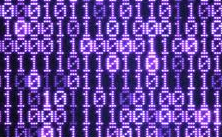

O formato binário
=================

Naveguação | [ANTERIOR][_A] | [TOPO][_H] | [PRÓXIMO][_P]
-----------|----------------|------------|--------------

Aquário é _algo que contém água_, mostruário é _amostra de algo_, portuário é _algo que tem a ver com portos_,
e **binário** é _ALGO QUE ESTÁ EM DOIS_.

Parece simples, e realmente o é.
Por outro lado, toda a complexidade em volta do assunto _binário_, ou _formato binário_, ou _código binário_
tem a ver com o fato de não haver mais explicações para isso: É simplesmente algo que está em pares.

A forma de um _quadrado_ você já sabe e pode imaginar mesmo agora quando lê essas linhas, do mesmo modo
sabe qual a forma de um _círculo_, ou de um _triângulo_. Também provavelmente consegue imaginar a forma de
uma montanha ou de uma xícara. Então **forma** é uma palavra que usamos para significar _como nós entendemos algo_.

Já o **formato** é quando relacionamos alguma coisa com uma **forma** pré-definida, ou seja,
"àquela nuvem tem o formato de um coração", relacionamos a _nuvem_ a forma _coração_. Quando usamos essas
comparações, ou seja, por formatos, normalmente estamos querendo transmitir uma informação qualquer a outra pessoa.
Então transmitimos essa _mensagem_ usando formatos; e quem recebe a mensagem pode reconstruir em sua mente,
e entender o conteúdo.

Os formatos, ou _mensagens formatadas_, permitem a comunicação entre partes.

Quando falamos em **formato binário**, estamos nos referindo a algo que está relacionado a pares, e pode ser
representado por algo que visivelmente denotam 2 (duas) e unicamente 2 (duas) coisas distintas, e normalmente
opostas. Ex: PRETO ou BRANCO; NOITE ou DIA; FRIO ou QUENTE; ALTO ou BAIXO; SIM ou NÃO; VERDADEIRO ou FALSO etc.

## Computadores não são inteligentes

Muitas pessoas dizem que computadores são _super inteligentes_ e alguns ainda dizem que computadores são mais
inteligentes do que os humanos, outros ainda se perguntam se os computadores irão dominar a humanidade.

Costumo dizer que: "Computadores são burros, não conseguem entender nada além de SIM e NÃO. Por isso foram
feitos para obedecer ordens."

Se por um lado os computadores não são inteligentes e nós (seres humanos) somos; por outro lado os computadores
são extremamente obedientes e rápidos, coisa que não somos.

Mas para que possamos aproveitar o potencial dos computadores, precisamos entender suas limitações, ou seja,
o fato de só entender SIM e NÃO; para que assim consigamos nos comunicar e dizer a eles o que fazer por nós.

## O bit - simples zeros ou uns, mas completo

Àpesar de o formato binário (SIM ou NÃO) ser ingenuamente simples, podemos representar qualquer coisa complexa
com essas simples informações, desde que entremos em acordo.

### Onde está a parte simples?

O bit é representado por "0" (zero) ou "1" (um). Pronto e acabou!

Entendeu?

Ligado ou desligado, e nada mais. Simples assim.

#### Mais detalhes sobre esse simples bit

Um detalhe importante é lembrar que quando falamos em computação e mencionamos o tal "formato binário", nós
também costumamos dizer que tudo pra o computador são "zeros" e "uns", ou algo como "0101010101010101110001010".

Isso é verdade porque o "0" (zero) está representando NÃO, e o "1" (um) está representando o SIM.
Mas no fundo no fundo, o que esses zeros e uns querem dizer é melhor representado por LIGADO ou DESLIGADO.

Isso porque o computador é uma peça elétrica, e a única coisa que importa pra ele é se algo está com ou
sem energia, e é baseado nisso que ele toma suas decisões.
Se algo tem energia, está ligado e ele pode fazer algo; se não tem energia está desligado e então ele faz
outro algo.

Se esse _"algo"_ é uma célula magnética, ou um fio, ou uma válvula, não importa. O que importa realmente
é só saber o que esse algo representa, das informações que o próprio computador conhece, ou seja, LIGADO
ou DESLIGADO, 0 (zero) ou 1 (um)

A essa informação chamamos de **bit**. Bit é a única linguagem que o computador entende.

### E onde está a parte completa?

Àpesar de um bit ser extremamente simples, se você agrupar o número suficiente deles poderá representar o
que quiser. Ficando limitado apenas pela quantidade de bit's que você conseguria agrupar.

Se eu fosse dizer pra você: "zero, um, zero".

Eu poderia dizer: **"zero, um zero"** e você entenderia.
Também poderia dizer: **"010"**

> TODO: Pro computador digo o mesmo ele entende

> TODO: Mas se eu disser: "abacate"

> TODO: Você entender com "abacate", uma figura de "abacate"

> TODO: Mas o computador pode entender com "0101010101"...

Naveguação | [ANTERIOR][_A] | [TOPO][_H] | [PRÓXIMO][_P]
-----------|----------------|------------|--------------

<!-- Links de navegação -->
[_A]: ./programs.md "Os programas de computador"
[_H]: ../index.md "Topo"
[_P]: ./compiler.md "O compilador"

<!-- Outros links -->
