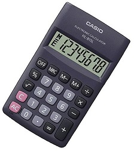
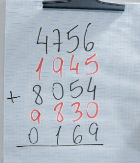
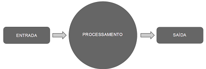
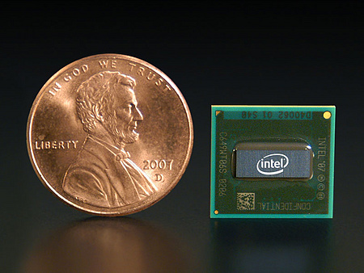

O mundo dos computadores
========================

Naveguação | [ANTERIOR][_A] | [INÍCIO][_H] | [PRÓXIMO][_P]
-----------|----------------|------------|--------------

Não vamos falar aqui sobre "A história dos computadores", caso queira saber mais sobre o assunto [veja esse artigo fantástico no TecMundo][TECMUNDO-LINK].

Mas pra você se divertir um pouco, vou deixar alguns links de vídeos bem legais (e antigos) sobre essa maravilhosa história de evolução do computador. O que não posso garantir é que eles estejam sempre disponíveis, então, se algum dos links estiver quebrado, "me desculpem". Mas acredito que você vai se divertir um bocado com essas histórias:

* [História: E evolução dos computadores][VIDEO1-LINK]
* [Chegada do Celular no Brasil][VIDEO2-LINK]
* [Jornal Hoje 1981 - O Computador no Brasil][VIDEO3-LINK]
* [O mito do programador autodidata - LF Bittencourt][VIDEO4-LINK]
  - Tirando alguns palavrões que o palestrante usa, é bem legal.
  - Achei interessante porque a história dele é parecida com a minha, exceto que eu não consegui o estágio nem a consegui a bolsa
  - Mas é bem legal, que ele explica sobre "auto-didata", o que eu também disse no início que sou (e sou em partes).
  - E todos os programas que ele menciona, eu também trabalhei. Minha jornada foi bem parecida, e até ele começou na mesma época que eu
  - PS: Eu não conheço o palestrante
* [Maravilhas Modernas: A Evolução da Memória][VIDEO5-LINK]
* [Como funciona a arquitetura de um processador Intel Pentium][VIDEO6-LINK]
* [A importância de Aprender a Programar desde cedo][VIDEO7-LINK]
* [Chegada do Atari 2600 ao Brasil][VIDEO8-LINK]
* [Programando no CP 500 no Brasil][VIDEO9-LINK]
* [Comercial de Notebook 486][VIDEO10-LINK]
* [Comercial de um Pentium 133Mhz][VIDEO11-LINK]
* [Reportagem sobre o vírus de computador][VIDEO12-LINK]
  - E a sessacional solução para não ser afetado pelo vírus: "Simplesmente não usar o computador no dia 6 de março"
* [Jô Soares, reportagem sobre o avanço tecnológico da informática. 1992][VIDEO13-LINK]
  - Esse é legal porque já tinha "touch screen"
* [O INICIO DA INTERNET NO BRASIL ( Internet World 1996 )][VIDEO14-LINK]
* [Comercial do Celular Claro Sandy e Junior][VIDEO1-LINK]

Imagino que após conhecer um pouco da história com computador e se divertir um tanto com os vídeos sugeridos, agora você queira saber o que sobre o computador é tão importante saber. Pois bem, a parte fundamental que você precisa saber é que ele (o computador) é uma ferramenta eletrônica capaz de calcular dados e exibir resultados quase na velocidade da luz (só pra você entender que é bem rápido).

Sei que parece meio óbvio, e que talvez você estava esperando uma explicação mais glamurosa, mas é só isso mesmo: _"Um computador é uma calculadora super rápida e pronto"_.

## Os pontos centrais

Observando a resposta simplista dada no parágrafo anterior podemos destacar os seguintes pontos centrais contidos nela:

### "quase na velocidade da luz"

Pra você saber que ele é muito útil porque pode fazer o que nós já sabemos fazer de cabeça, só que _muuuiiittooooo_ mais rápido. Então um computador é util porque podemos fazer muito mais coisas do que se fossemos fazer manualmente, ou de cabeça.

### "capaz de calcular dados"

Um computador é essencialmente uma ferramenta matemática, porque é através da matemática que especificamos esse mundo dos cálculos.

Pra tudo que observamos ou fazemos no mundo, nós temos algum tipo de _"explicação lógica"_, que muitas vezes é descrita em algum tipo de fórmula ou notação:

* Quando você fala de compromissos você sabe que existem datas e tempos com horas, minutos, etc.
  - Logo, quando marca algum compromisso o faz em um determinado dia, hora.
  - Sabe se está atrasado ou adiantado porque calcula o tempo marcado ao atual.
  - Sabe quem é mais velho ou mais novo porque compara a data atual com a data do nascimento.
* Quando vai fazer uma viagem de carro, consegue imaginar quanto vai custar em dinheiro, porque conhece as distâncias, e tem a informação que o veículo tem autonomia de X kilômetros por litro de gasolina, e sabe que a gasolina está um absurdo, então calcula quanto vai custar sua viagem;
* Sabe que tem que achar uma tomada pra recarregar o celular porque ele está só a 10%, e você quer terminar de assistir o filme por inteiro e ainda faltam 0 minutos pra terminar.
* Quando quer fazer um bolo, sabe que precisa ir ao mercado comprar mais ovos porque na geladeira só tem 3 e a receita pedem 6. E inclusive você precisará dobrar a receita porque ela só serve 2 e "papai e mamãe" vão vir pro café da manhã então não vai ser só você e o maridão (ou esposa).

Na verdade enquanto eu mencionava esses exêmplos do dia-a-dia você os conseguia entender automaticamente, mas isso é porque você já aprendeu a calcular e fez isso sem nem perceber, além de saber as notações, coisas como hora, data, kilômetro, diferença, dobro, etc..

Nossa vida e tudo que fazemos ou observamos é traduzida em cálculos e notações. Isso é o que chamamos de mundo lógico, e tudo que é lógico pode ser computado, ou melhor: calculado.

Então um computador pode fazer pra nós, nossos cálculos lógicos do dia-a-dia.

### "e exibir resultados"

Você sabe identificar este objeto, certo?

> E aliás, essa calculadora é um computador, e a única coisa que a diferencia dos computadores que usamos pra programar ou executar nossos programas como estamos imaginando aqui nesse curso, é a quantidade e qualidade dos recursos.

Se você pegar uma calculadora como essa agora mesmo, mas colocar uma fita no visor dela, e imaginemos que ela não emita nenhum som. Então você começa a apertar seus botões:

* primeiro o "1"
* depois o "+"
* em seguida o "2"
* e por fim o "="

Em que resultou?

Talvez você tenha respondido: 3! Isso porque 1 + 2 é igual a 3.

Mas você não viu o resultado. Você confiaria que a calculadora realmente fez o trabalho certo? Ou que ela está funcionando?

Na verdade, talvez em algum momento você já tenha pego uma calculadora que estava com o visor quebrado, mas que fora o visor, o restante estava funcionando perfeitamente. Só que você digitava as teclas e nada aparecia, então pra você não serviria de nada, porque você não "via o resultado".

Eu comentei em algum parágrafo acima que a calculadora "não emitia som". Talvez você com sua calculadora com visor quebrado, enquanto digitava as teclas ela emitia um "beep" desses que algumas emitem, então você até imaginava: "vixi, parece que está funcionando. Mas eu ainda não vejo o resultado". Mesmo assim não serviria, então você provavelmente a descartou.

**O que quero dizer com isso?**

Na verdade nós usamos os computadores para servir a algum propósito que nos beneficie. Se não tiver utilidade pra nós, não serve, então não precisamos.

Uma calculadora que calcula, mas não mostra o resultado, não tem utilidade.

Logo, o que nos interessa em um computador é o resultado que ele nos entrega, porque é isso que nos serve.

### Um pouco mais sobre o exemplo da calculadora

Na verdade usar a calculadora para calcular "1 + 2" também é algo meio inútil, porque nós já fazemos isso com muita facilidade.

Agora calcula aí quanto é _"4.744.784 + 357.272 + 12.234.234 + 23.827.836 - 36.672"_.

4744784 + 357272 + 12234234 + 23827836 - 36672

`... 1, 2, 3 acabou o tempo!`

Provavelmente você não conseguiu chegar ao resultado em três segundos.

Mas se você usar uma calculadora (uma que funcione) e digitar essa fórmula, quando no final você pressionar o botão "=" verá o resultado "41.127.454" que se for escrito por extenso seria:

`Quarenta e um milhões, cento e vinte e sete mil, quatrocentos e cinquenta e quatro.`

> É claro que eu não fiz de cabeça. Abri aqui minha calculadora, copiei e colei o texto nela e cliquei em "=".

Apesar de sabermos a lógica pra calcular isso, e de conhecermos os símbolos da notação matemática que nós mesmos (humanos) criamos, e de conseguir expressar isso em uma fórmula. Se fôssemos fazer somente com nosso pensamento (raciocínio) provavelmente demorariamos um pouco pra chegar ao resultado, alguns até não conseguiriam. Na verdade a maioria de nós mortais só conseguirá se usar alguns rascunhos do tipo:

Assim podemos concluir que nós (seres humanos) somos realmente muito bem dotados de uma coisa chamada "inteligência", e com ela criamos coisas incríveis. Entendemos como o universo funciona (em partes), temos a escrita, e com ela especificamos notações, e pra cada coisa que aprendemos conseguimos representa uma fórmula, e com as fórmulas aplicadas em cima de um punhado de dados nós conseguimos até prever muitas coisas.

Mas somos muito lentos pra calcular.

E por isso usamos nossa inteligência pra criar essa ferramenta fantástica, que à pesar de não ser dotado de nenhuma inteligência, é estremamente rápida pra fazer as coisas.

Podemos dizer que o computador e o ser humano se completam, suprindo um a deficiência do outro.

"O ser humano com sua inteligência e o computador com sua velocidade".

## Alguns outros pontos

Eu já poderia encerrar aqui porque imagino que chegamos ao ponto que importa. Saber que o computador é uma máquina que nos completa na nossa deficiência de velocidade pra fazer as coisas. Mas existem algumas outras "coisitas mas" que gostaria de citar.

E agora vou fazer isso de forma mais "curta e grossa" pra não gastar tanto seu precioso tempo.

### O fluxo do computador

O computador funciona essencialmetne com alguma informação de entrada, processa essas informações, e exibe o resultado final. Com isso seu trabalho acabou.

Isso é chamado de processamento, e é por isso que ele tem uma peça dentro dele chamada de ["processador"][MICROPROCESSADOR-LINK], e como ela é pequena, na verdade "micro", mais corretamente chama-se ["microprocessador"][MICROPROCESSADOR-LINK].

Basicamente este desenho.

É claro que isso dá a idéia de um trabalho que termina, e você olhando pra seu computador ou smartphone e vê ele funcionando quase que de forma viva. Digo, ele não parece terminar um trabalho, parece vivo, até que eu decida desligá-lo.

Mas o que ocorre é que ele executa uma tarefa, e termina, mostra o resultado, e em seguida inicia a mesma tarefa novamente, ou outra tarefa, na verdade são infinitas tarefas sendo executadas e repetidas. Com isso temos a impressão que não existe fim nas tarefas, mas existem, elas só estão se repetindo.

Mas o funcionamento do computador pode se resumir nessa imagem aí acima: Existe uma entrada, o computador processa a informação, exibe o resultado e acabou.

### Dispositivos de entrada e saída

O [microprocessador][MICROPROCESSADOR-LINK] é o computador em si. Porém se você retirar ele de dentro da caixa (CPU) que normalmente está em cima de nossa mesa representando o que entendemos por computador, ou de dentro de nosso notebook, ou até mesmo de dentro de nosso smartphone. Se você retirar o [microprocessador][MICROPROCESSADOR-LINK] lá de dentro e comparar com o que sobrou, não dá pra acreditar que o computador mesmo é só aquela peça pequena.

Mas é! Só que pra ser útil o computador precisa de dados de entrada. E você precisa de um meio pra informá-los. Aí você usa um "teclado", ou um "mouse" conectado em uma porta USB. E depois você quer ver o resultado, então precisa de uma "tela" pra exibir seu resultado, que não seria só um número, mas toda uma imagem, ou um filme. Não importa o quão lindo ou complexo que possa parecer assistir um filme em Full-HD ou 4K, no fim é só o resultado de um processamento de dados de entrada.

Uma tela "touch" do seu smartphone que ocupa praticamente todo o tamanho do mesmo, ela serve tanto pra você entrar com as informações, quanto pra apresentar o resultado.

Uma música que você está ouvindo é só uma saída de informações processadas em um formato diferente.

Nós reconhecemos um "teclado" e "mouse" facilmente como um dispositivo de entrada, e uma "tela" ou um "phone" como um dispositivo de saída. Mas existem muitos outros menos percebidos,

Por exemplo: Nosso roteador Wi-Fi que fica capturando as informações em forma de ondas de rádio em nosso ambiente e entrando com essas informações no nosso processador. Na verdade ele também recebe outras informações calculadas em nosso processador e as re-transmite pra o ambiente novamente que vai ser capturada por outro dispositivo; tornando-se assim tanto um dispositivo de entrada como de saída.

E o que dizer dos leitores biométricos e de retina, ou as impressoras, e os "botões vermelhos de ligar" motores, e os próprios motores que giram coisas após receberem um sinal pra isso que nosso computador calculou...

Emfim, temos toda uma variedade de dispositivos que auxiliam nosso computador na tarefa de ser útil pra nós. Mas eles são somente isso, dispositivos de coleta e apresentação de dados calculados pelo computador.

### Parece óbvio mas não é

Talvez falar sobre o computador pareça algo bem básico pra você. Parece que todas essas coisas que falamos neste capítulo você já sabe.

Mas o que quero que você entenda, é que: Isso tem que ser realmente óbvio pra você que é um programador. Tão óbvio que você consiga falar com naturalidade sobre todos os pontos mencionados e muitas outras coisas. Afinal você precisará conhecer todo ele para que possa se meter a programá-lo na execução das mais diversas tarefas que ele pode fazer pra nós.

Precisa ser tão óbvio pra você, para que não seja como os vendedores de smartphone.

**falo isso porque lembrei de uma historinha que aconteceu comigo (e às vezes se repete)...**

Uma vez fui comprar um smartphone em uma loja, e por ele ser um computador e eu trabalhar diariamente com computadores fiz as perguntas básicas que são óbvias pra mim ao vendedor pra que eu pudesse escolher melhor qual iria levar. Então eu perguntava:

* Qual o preço? O vendedor me falava
* É o último modelo? O vendedor respondia
* Qual a capacidade? Aí ele me dizia

Então perguntei: E quanto tem de memória?

Aí o vendedor me responde "32 Gigas". Eu pensei logo "caraka", meu PC tem 8GB de memória e eu já tô feliz, e agora um smartphone com 32GB...

Mas eu me referia a memória RAM, e o vendedor a "memória interna". Então eu olhei no aparelho e vi que se tratava de armazenamento e não de memória de processamento (RAM). Aí pensei que tinha me expressado mal ao vendedor, e expliquei:

"Não. Eu quero saber da memória RAM, não do armazenamento"

E a surpresa foi que o vendedor não sabia a diferença entre isso de memória de armazenamento e memória de processamento. No treinamento ele só tinha recebido a informação de que tinha X de memória e era isso que importava. Quanto mais memória (tanto faz qual) melhor era.

Pra maioria das pessoas (usuários de computador) isso é o que importa, mas pra mim que iria usar celular pra testar meus programas era importante saber da memória RAM.

Saindo do exemplo do vendedor de smartphones.

Como programador, você não pode se contentar em saber só o básico pra usar os computadores, o uso tem que ser tão óbvio pra você quanto o funcionamento. E isso porque você vai pra uma escala ainda maior, porque na verdade você vai se utilizar da forma como ele funciona para programa esse tal funcionamento.

Você é a pessoa que vai ditar como o computador deve funcionar pra fazer aquilo que você quer que ele faça.

## Conclusão

As vezes você se matou de rir com os vídeos antigos do início deste capítulo. Parece que o que àquelas pessoas estavam mostrando com tanta empolgação no começo como se fossem uma novidade fantástica, é pra você agora como se fossem totalmente ignorantes comparados a você.

Mas o fato é que antes do computador aquelas tarefas eram impossíveis de se fazer. O fato de alguém falar com uma outra de um telefone sem fios, é óbvio pra você agora, mas antes era simplesmente impossível. Mas alguém usou o computador para calcular alguns dados e se utilizou de alguns dispositivos de entrada/daída (antenas e receptores) e fez a mágica acontecer.

Você vai criar coisas agora que ainda não existem, vai fazer coisas que serão fantásticas, e vai se orgulhar disso. Mas o que hoje te impressiona, ou faz você sentir orgulho de ter criado, daqui a 10 ou 20 anos vai causar a mesma sensação em você mesmo ou seus filhos e as outras pessoas - enquanto você se vê em um vídeo no YouTube todo empolgado falando sobre sua novidade, vai parecer como se fosse um totalmente ignorante pras pessoas a frente da sua época (que é agora), eles vão ver isso e tirar "sarro" da mesma forma como nós estamos fazendo agora ao ver esses vídeos antigos.

O fato é que não importa. Com o computador, e mais especificamente, a programação do computador: podemos fazer com que ele nos ajude a criar as coisas mais fantásticas e inimagináveis que estão somente em nossas mentes. Estamos sempre nos impressionando com as coisas maravilhosas e mágicas que essa ferramenta faz, e nós "os programadores", somos os responsáveis por criar essas fantásticas coisas chamadas "programas" que causam as mais fantásticas reassões nas pessoas quando os vê funcionando e impressionando-as.

Com o computador nós sempre podemos criar novas coisas, e essas coisas são "programas de computador".

Concluo dizendo:

> "Respeite, admire, entenda e tire o máximo proveito do computador pra fazer todas as coisas fantásticas que estão na sua mente"

Naveguação | [ANTERIOR][_A] | [INÍCIO][_H] | [PRÓXIMO][_P]
-----------|----------------|------------|--------------

<!-- Links de navegação -->
[_A]: ./intro.md "Capítulo 1 - O \"básico\""
[_H]: ../../../README.md "Início"
[_P]: ./programs.md "Os programas de computador"

<!-- Outros links -->
[TECMUNDO-LINK]: https://www.tecmundo.com.br/tecnologia-da-informacao/1697-a-historia-dos-computadores-e-da-computacao.htm
[VIDEO1-LINK]: https://www.youtube.com/watch?v=mFdUqqwzbVs
[VIDEO2-LINK]: https://www.youtube.com/watch?v=PeCZU6Y3eIU
[VIDEO3-LINK]: https://www.youtube.com/watch?v=NSVoKeiBSm0
[VIDEO4-LINK]: https://www.youtube.com/watch?v=8k8FtqviV5I
[VIDEO5-LINK]: https://www.youtube.com/watch?v=vIY2fSwkUYQ
[VIDEO6-LINK]: https://www.youtube.com/watch?v=LN6LuhRYzuA
[VIDEO7-LINK]: https://www.youtube.com/watch?v=1abR0FEG16g
[VIDEO8-LINK]: https://www.youtube.com/watch?v=BFoiqJ8PM0Q
[VIDEO9-LINK]: https://www.youtube.com/watch?v=mWXboyLKuUA
[VIDEO10-LINK]: https://www.youtube.com/watch?v=VyDCOMMmFog
[VIDEO11-LINK]: https://www.youtube.com/watch?v=sEhYumJiEbY
[VIDEO12-LINK]: https://www.youtube.com/watch?v=tVAe9eSHBQQ
[VIDEO13-LINK]: https://www.youtube.com/watch?v=3Ma0Gy0HqOI
[VIDEO14-LINK]: https://www.youtube.com/watch?v=AJr0No21Ibk
[VIDEO15-LINK]: https://www.youtube.com/watch?v=RqZPU0eSjNk
[MICROPROCESSADOR-LINK]: https://pt.wikipedia.org/wiki/Microprocessador